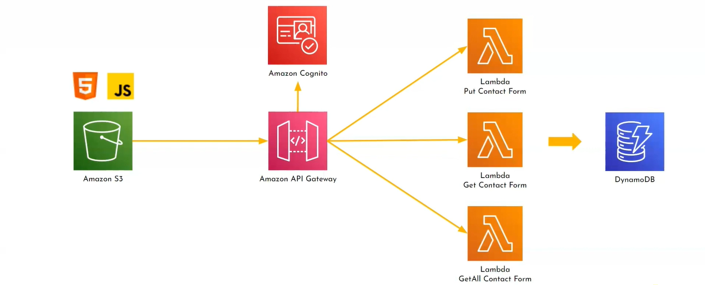
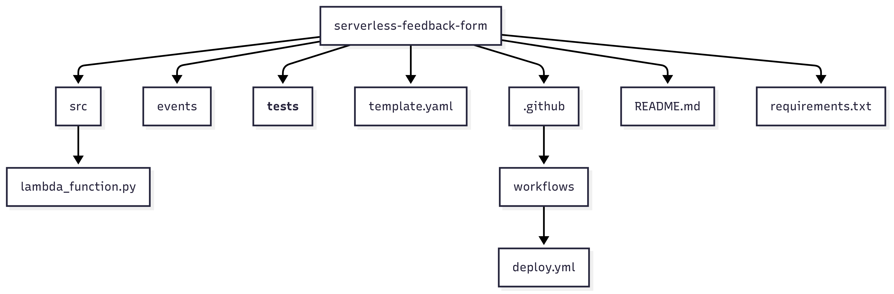

# 📦 Serverless Feedback Form – Mini Project

This project implements a serverless REST API using **AWS Lambda**, **API Gateway**, and **DynamoDB** to collect and store user feedback. It was built as part of a cloud computing mini-project and deployed using **GitHub Actions** for automation.

## 📌 Overview

- Accepts feedback from users via POST request.
- Stores data (`name`, `email`, `message`) in DynamoDB.
- Powered by AWS services in a serverless architecture.
- Fully automated deployment through GitHub CI/CD.

---

## ⚙️ Tech Stack

| Area        | Tools/Services                        |
|-------------|----------------------------------------|
| Language    | Python 3.11                            |
| Backend     | AWS Lambda, API Gateway                |
| Database    | Amazon DynamoDB                        |
| Access Ctrl | AWS IAM                                |
| Monitoring  | AWS CloudWatch                         |
| CI/CD       | GitHub Actions                         |
| Testing     | Postman, CloudWatch Logs               |

---

## 🔧 Architecture



---

## 🗂️ Project Structure



---

## 🚀 Deployment Instructions

1. **Create IAM Role** with permissions for Lambda, DynamoDB, and CloudWatch.
2. **Deploy Lambda** with environment variables and link it to **API Gateway**.
3. Configure GitHub Actions with `AWS_ACCESS_KEY_ID` and `AWS_SECRET_ACCESS_KEY` secrets.

### Run CI/CD Workflow
```yaml
# .github/workflows/deploy.yml
on: [push]
jobs:
  deploy:
    runs-on: ubuntu-latest
    steps:
      - uses: actions/checkout@v2
      - name: Setup AWS CLI
      - run: |
          pip install awscli
          aws lambda update-function-code --function-name <your_lambda> --zip-file fileb://function.zip
```

---

## 🧪 API Reference

### POST `/feedback`
Send user feedback to DynamoDB.

#### Sample Request
```json
{
  "name": "Jane Doe",
  "email": "jane@example.com",
  "message": "Great job!"
}
```

#### Sample Response
```json
{
  "statusCode": 200,
  "body": "{"message": "Feedback submitted successfully"}"
}
```

---

## 🧾 Testing

- Test using **Postman** or `curl`
- Monitor Lambda logs on **AWS CloudWatch**
- Use `events/event-feedback.json` for offline testing

---

## 🧠 Learnings

- Hands-on with serverless architecture
- IAM roles and permission models
- AWS CLI automation and CI/CD pipelines
- Applying SDLC principles to cloud-native development

---

## 👨‍💻 Contributors

| Name              | Role                     |
|-------------------|--------------------------|
| Naveen Kumar Varma | API Gateway Setup, Lambda, Testing, Docs |
| Shrihari Shinde   | IAM, CI/CD, DynamoDB setup |

---

## 📚 References

- 📺 [API Gateway](https://youtu.be/c3J5uvdfSfE?si=cs0AhfickUPYTzCZ)
- 📺 [DynamoDB](https://youtu.be/2k2GINpO308?si=sNSQ2gR-ix4nQTbV)    
- 📘 [AWS Lambda Docs](https://docs.aws.amazon.com/lambda/)  
- 📗 [GitHub Actions Docs](https://docs.github.com/en/actions)
